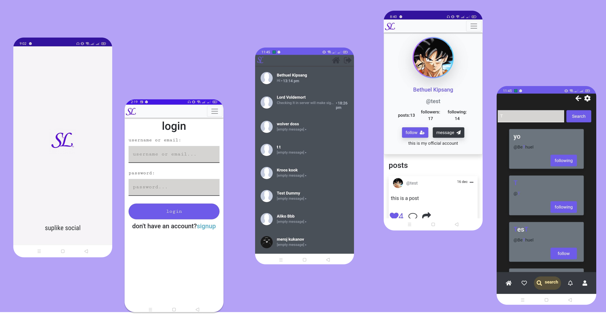

# hello welcome to suplike


[](https://github.com/bethropolis/suplike-social-website)

[](https://www.codefactor.io/repository/github/bethropolis/suplike-social-website)


<p>
 suplike is a social website similar to instagram and facebook for socializing and communications.<br />
 I built it some years back and it has been one of my favourite projects.<br/>
 it's made out of <b> PHP/JS/CSS</b> <br />
  
it's easy to install and setup[features](#features);

check out [demo]('https://suplike.xyz);

</p>


# Table 
- [getting started](#getting-started)
  - [Installation](#installation)
  - [instalation steps](#installation-steps)
- [Components](#components)
- [versions](#versions)
- [features](#features)
- [Future Improvements](#future-improvements)
- [inspiration](#inspiration)
- [behind it all](#behind-it-all)
- [license](#license)

<br />

# getting started

## Installation

#### Requirements

- PHP
- Apache server
- MySQL Database
- SQL
- phpMyAdmin

> All of these requirements can be completed at once by simply installing a server stack like `Wamp` or `Xampp` etc.

### Installation Steps

1. Download the latest release file.

   * [v1.46 zip file](https://github.com/bethropolis/suplike-social-website/archive/refs/tags/1.46.zip)
   * [v1.46 tar.gz file](https://github.com/bethropolis/suplike-social-website/archive/refs/tags/1.46.tar.gz)

   you can get other releases [here](https://github.com/bethropolis/suplike-social-website/releases).

2. unzip the file and extract all the files into your `htdocs` or `www` directory depending on what you are using.
> I recommend renaming the folder to `suplike` (the url will be shorter).

<br/>

alternatively you can clone the repository to your `htdocs` or `www` folder.
   ```
     git clone https://github.com/bethropolis/suplike-social-website.git suplike
   ```
> now you are ready to setup.


## setup and configure database

### using the GUI
 the GUI is a nicer interface which will automatically setup the database and create admin account for you easily.


<br>
To open the GUI, start apache if off, then on the browser navigate to `https://localhost/suplike/inc/setup/`, insert the credentials to your database and admin account after which you will automatically be logged in as admin.

> please note in the url, replace `suplike` with what you named the folder or the folders name.
<br>

### incase GUI doesn't work

1. Edit the `inc/setup/setup.suplike.json` file and set the value of `"setup"` to  `false` then reopen the GUI in your browser.

2. Do it Manually, Import the `suplike.sql` file in the `sql` folder into phpMyAdmin. There is no need for any change in the .sql file. This will create the database required for the application to function. Next, change the code below to the respective database credentials and insert it into `inc/setup/env.php`  ; 

```php
 if (!defined('DB_DATABASE'))        define('DB_DATABASE', 'suplike');
 if (!defined('DB_HOST'))            define('DB_HOST','localhost');
 if (!defined('DB_USERNAME'))        define('DB_USERNAME', 'root');
 if (!defined('DB_PASSWORD'))        define('DB_PASSWORD', '');
 if (!defined('DB_PORT'))            define('DB_PORT',3306);
```

## Components

#### Languages

```
PHP 7.1.0
SQL 14.0
JavaScript ES 6
HTML5
CSS3
```

#### Development Environment

```
xampp v3.2.4
Windows 10
```

#### Database

```
MySQL Database 8.0.13
```

#### DBMS

```
phpMyAdmin 4.8.3
```

#### Frameworks and Libraries

```
JQuery v3.3.1
BootStrap v4.2.1
font awsome v4.7.0
vue v2.6
```

#### Techniques

```
AJAX
```

# versions

check `HISTORY.md`

<p>
  more improvements will continue to be done to this project please stay and watch 👀.
</p>

# features
## Mobile UI

<br/>
The site is mobile friendly with a cool and nice mobile UI + dark theme

## image and text post

you can currently only post either an image or text
likely more in new versions to come.

## like & follow system

you can like a post or unlike it, comment and share are still not functional but the
like system is fully working together with the follow system and
bothare perfect and most secure.

## live messaging/chat system (whole new look)

 <br/>

in previous version, one of the issues was that the messaging page was just
a page. Live messaging was not well supported and you could not choose who to chat with until
you clicked message on their profile page. But in the new version, the entire code was re writen and the
whole of that is gone, you can chat with the people you follow
and it is more mobile responsive than previous and the only client page that uses Vuejs.

## home page

<br>
the home page is the main page where you can see post from some of the people you follow
and the first page you will land on.

## profile page

<br>
the profile page is still in my future update plans, still needs more work.

## settings page

 <br>
also needs more work

## login/signup system

<br>
you will have login or sign up to use the site.

## search page

<br>
the search page is where you can search for users for now.

## following page

<br>
The following page is where you can vue the users you follow (for now);

## other user pages
<br>
<br/>

## dashboard

<br>
The Admin Dashboard allows you to see analytics and perform moderation functions<br>

### you can do the following on the dashboard

- see post analytics
- moderate
- see new users and old users
- users online
- other analysis like chat,comment,share,likes and followings that occured in the week (for now)

# Future Improvements

---

- making the whole system depend on ajax api requests for speed on page load and easier for expansion (`social.php` would be a great example);
- `laravel` would really make this even easier;
- improving the UI (especially desktop)
- implementing PHPmailer to send emails e.g forgot password system
- admin dashboard [✔]
- youtube video posting and more formarts
- Continuous Bug fixes and improvements
- Bot's and AI features

> you can show support to this project by staring this repo, it really means alot to me.

# inspiration

my biggest inspiration to make this website was was the [KLIK social website](https://github.com/msaad1999/KLiK-SocialMediaWebsite) on github
whom I also made > 50% of the Readme from, thank you [msaad1999](https://github.com/msaad1999) for making an amazing project.

# behind it all

Hi I am bethuel(bethropolis).<br>
I love programming, ☕ and especially working with API's which you will see most in this project.
<br/>

<h5>ok, about this project.</h5>
The project is my Big(huge) project and I love it soo much and I will do all I can to constantly improve it.
more versions are to come check `HISTORY.md` for more. <br/>
if you like to contribute please don't mind sending a pull request I will
check it out the see if I can merge it, all ideas aloud.

 

[bethropolis](https://github.com/bethropolis)

# License

it is licensed under my favourate License [MIT license](https://mit-license.org/).
