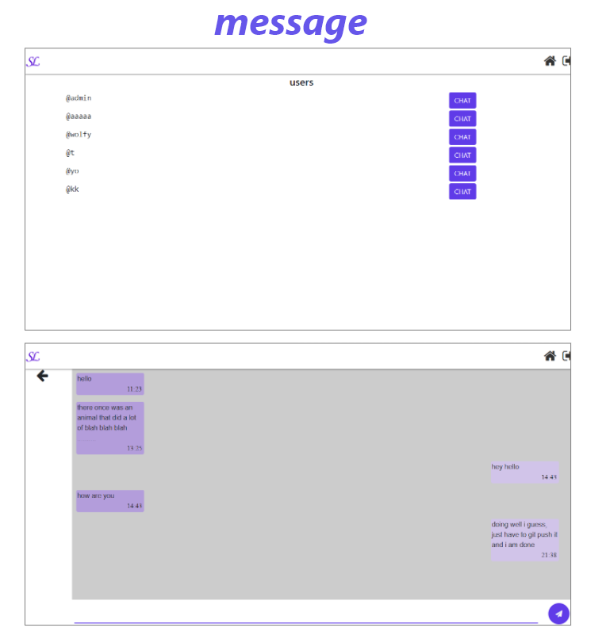
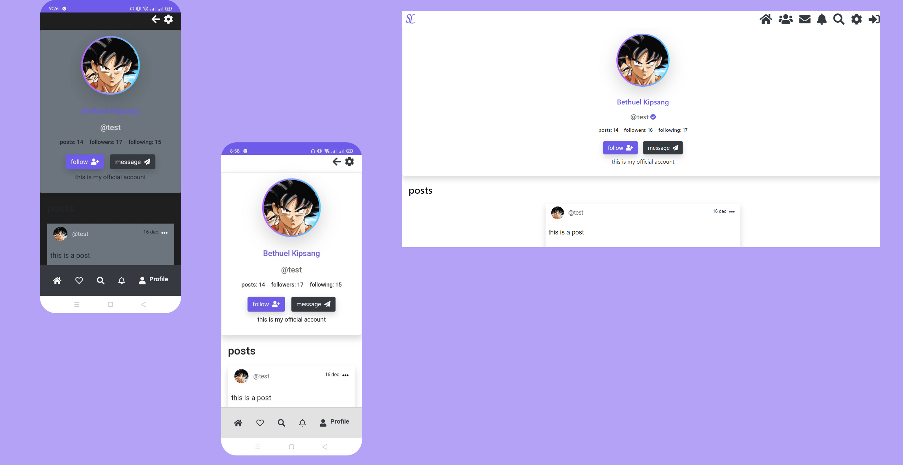
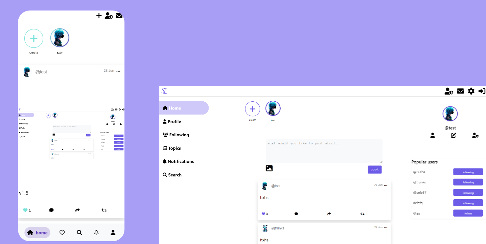
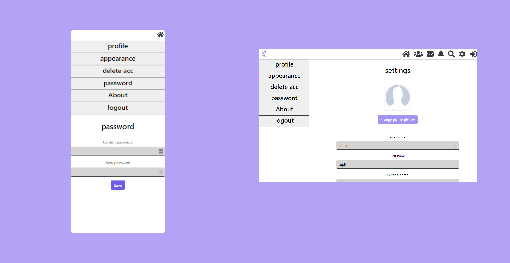
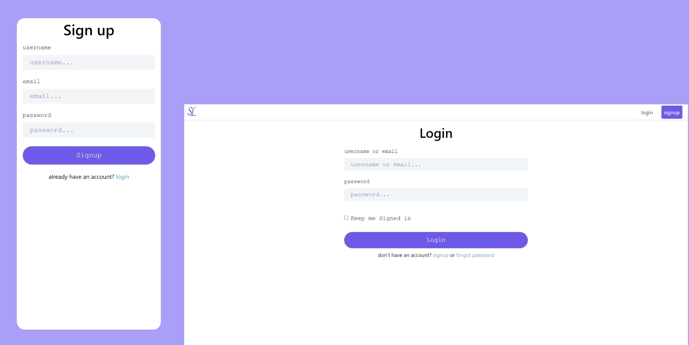
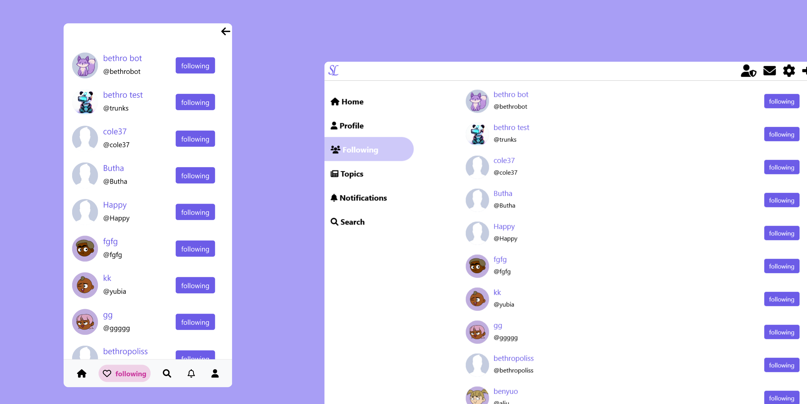
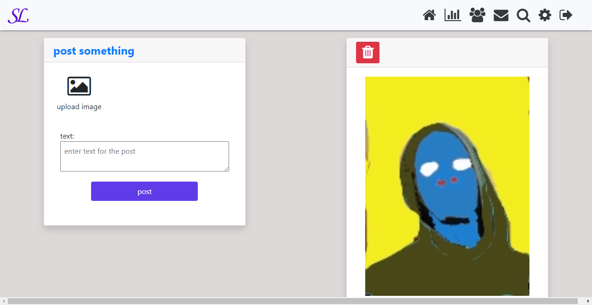
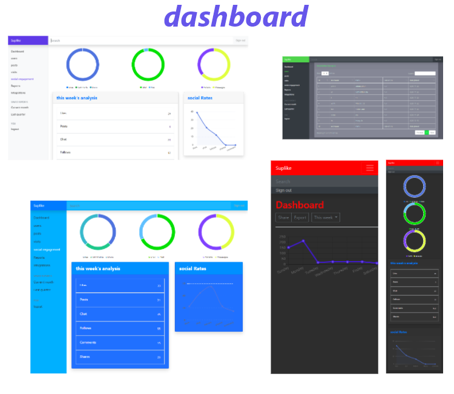

 
 
# hello welcome to suplike 

<p>
 suplike is a social website made out of <b> PHP/JS/CSS</b> <br />
  
suplike is made with various ideas from all around social medias like Facebook, instagram and 

  you can check the [features](#features);
</p>

 * [getting started](#getting-started)
    * [Installation](#installation)    
    * [instalation steps](#installation-steps)
 * [Components](#components)   
 * [versions](#versions)
 * [features](#features)
 * [Future Improvements](#future-improvements) 
 * [inspiration](#inspiration)
 * [behind it all](#behind-it-all) 
 * [license](#license)
  
<br />

# getting started

## Installation

#### Requirements
* PHP
* Apache server
* MySQL Database
* SQL
* phpMyAdmin

> All of these requirements can be completed at once by simply installing a server stack like `Wamp` or `Xampp` etc.
 
#### Installation Steps
1. Import the `suplike.sql` file in the `sql` folder into phpMyAdmin. There is no need for any change in the .sql file. This will create the database required for the application to function.

2. Edit the `dbh.inc.php` file in the `inc` folder to create the database connection. Change the password and username to the ones being used within current installation of `phpMyAdmin`. There is no need to change anything else.

```php
$servername = "localhost";
$dBUsername = "root";
$dBPassword = ""; 
$dBName = "suplike";  
$timeZone =  new DateTimeZone('Africa/Nairobi'); # change this to your timezone

$conn = mysqli_connect($servername, $dBUsername, $dBPassword, $dBName);
```
  
## Components

#### Languages
```
PHP 5.6.40
SQL 14.0
JavaScript ES 6
HTML5
CSS3
```

#### Development Environment
```
xampp v3.2.4
Windows 10
```

#### Database
```
MySQL Database 8.0.13
```

#### DBMS
```
phpMyAdmin 4.8.3
```

#### API
```
MySQLi APIs
```

#### Frameworks and Libraries
```
JQuery v3.3.1
BootStrap v4.2.1
font awsome v4.7.0 
vue v2.6
```
 
#### Techniques
```
AJAX
```


# versions
check `HISTORY.md` 
<p>
  more improvements will continue to be done to this project you may contribute
  or stay and watch 👀.
</p>


# features  
---   

## image and text post 
you can currently only post either an image or text 
likely more in new versions to come.

## like & follow system 
you can like a post or unlike it, comment and share are still not functional but the 
like system is fully working together with the follow system and 
bothare perfect and most secure. 
  
## live messaging/chat system (whole new look)
<br/> 
in previous version, one of the issues was that the messaging page was just 
a page. Live messaging was not well supported and you could not choose who to chat with until
you clicked message on their profile page. But in the new version, the entire code was re writen and the 
whole of that is gone, you can chat with the people you follow
and it is more mobile responsive than previous and the only client page that uses Vuejs.

## home page 
<br> 
the home page is the main page where you can see post from some of the people you follow 
and the first page you will land on.

## profile page
<br> 
the profile page is still in my future update plans, still needs more work.

## settings page
 <br> 
also needs more work 

## login/signup system  
<br> 
you will have login or sign up to use the site.

## search page
<br> 
the search page is where you can search for users for now.
 
## following page  
<br> 
 The following page is where you can vue the users you follow (for now);

## post page (new)
<br> 
the post page is new in v1.2, this is where you can make a post other than the main page it self

 
## dashboard (new)
<br> 
The Admin Dashboard is a whole new upgrade in v1.2, The dashboard is where you can view 
your analytics. The dashboard is one the biggest features of v1.2 and currently undergoing alot of modifications<br>


### you can do the following on the dashboard:
* see post analytics
* moderate
* see new users and old users 
* users online
* other analysis like chat,comment,share,likes and followings that occured in the week (for now)


# Future Improvements
---
* making the whole system depend on ajax api requests for speed on page load and easier for expansion (`social.php` would be a great example);
* `laravel` and `vue,js` would really make this even easier;
* adding lazy loading to the posts would make load time quicker
* improving the UI
* implementing PHPmailer to send emails e.g forgot password system
* admin dashboard [✔] 
* youtube video posting and more formarts
* Continuous Bug fixes and improvements

> you can show support to this project by staring this repo, it really means alot to me.   
 
# inspiration
my biggest inspiration to make this website was was the [KLIK social website](https://github.com/msaad1999/KLiK-SocialMediaWebsite) on github  
whom I also made > 50% of the Readme from and also top social websites like [facebook](https://facebook.com) gave me some tips.

# behind it all 
Hi I am bethuel(bethropolis) and happy to say I survived the bugs.<br>
I love programming and especially working with API's which you will see most in this project
and my spirit animal is the 🐺. 
<br/> 
<h5>ok, about this project.</h5>
The project is my Big(huge) project and I love it soo much and I will do all I can to constantly improve it.
more versions are to come check `HISTORY.md` for more. <br/> 
if you like to contribute please don't mind sending a pull request I will
check it out the see if I can merge it, all ideas aloud. 

 
    

[bethropolis](https://github.com/bethropolis) 

# License
it is licensed under my favourate License [MIT license](https://mit-license.org/). 
 
