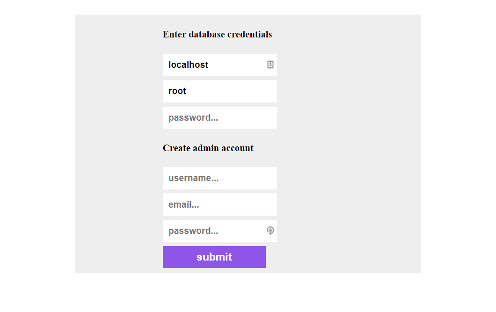
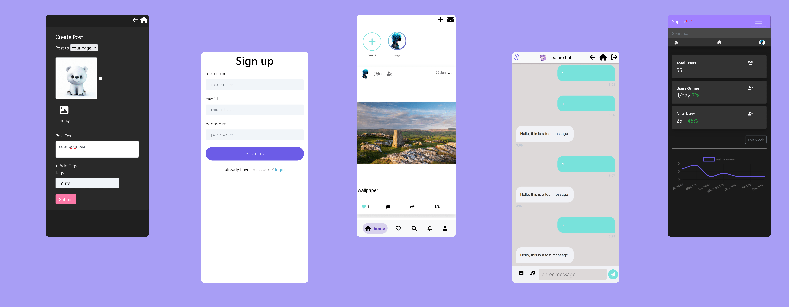
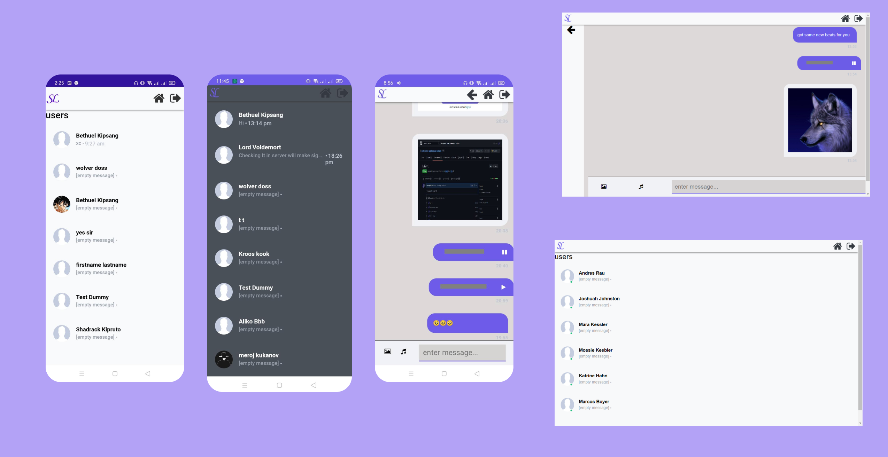
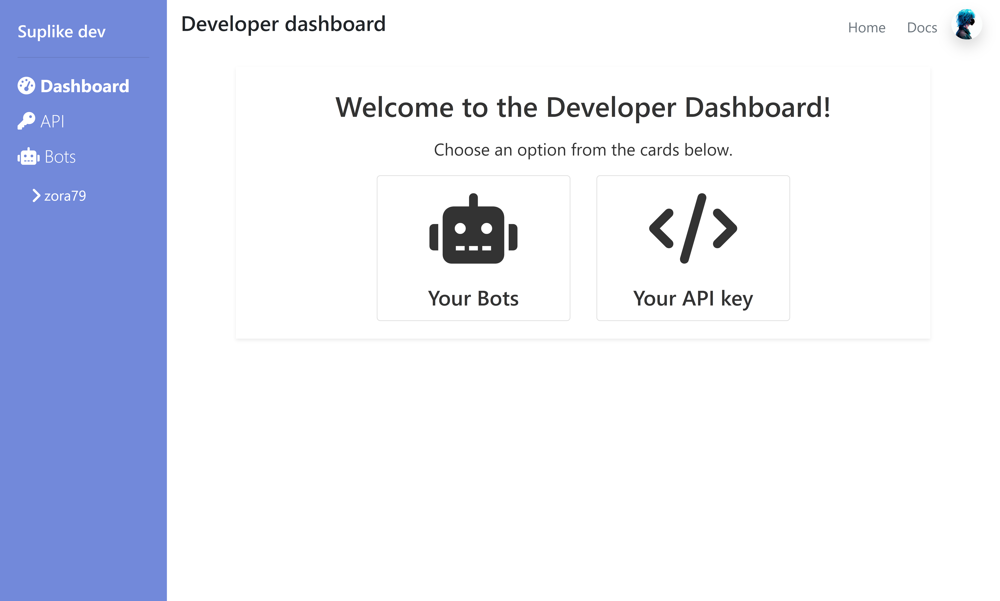

# hello welcome to suplike


[](https://github.com/bethropolis/suplike-social-website)

[](https://www.codefactor.io/repository/github/bethropolis/suplike-social-website)


<p>
 suplike social is a feature rich fully open source social network that is easy to selfhost.<br />


 it's made using <b> PHP/HTML/JS/CSS</b> <br />
  
it's easy to install and [setup](#features);

check out [demo]('https://bethro.alwaysdata.net/');

</p>

# Table of Contents

- [hello welcome to suplike](#hello-welcome-to-suplike)
- [Table of Contents](#table-of-contents)
- [getting started](#getting-started)
  - [Installation](#installation)
      - [Requirements](#requirements)
    - [Installation Steps](#installation-steps)
  - [setup and configure database](#setup-and-configure-database)
    - [using the GUI](#using-the-gui)
    - [incase GUI doesn't work](#incase-gui-doesnt-work)
  - [Components](#components)
      - [Languages](#languages)
      - [Development Environment](#development-environment)
      - [DBMS (optional)](#dbms-optional)
- [versions](#versions)
- [features](#features)
  - [Mobile UI](#mobile-ui)
  - [live messaging/chat system (whole new look)](#live-messagingchat-system-whole-new-look)
  - [home page](#home-page)
  - [profile page](#profile-page)
  - [login/signup system](#loginsignup-system)
  - [search page](#search-page)
  - [following page](#following-page)
  - [image and text post](#image-and-text-post)
  - [like \& follow system](#like--follow-system)
  - [Developer Page](#developer-page)
  - [other user pages](#other-user-pages)
  - [Admin dashboard](#admin-dashboard)
    - [you can do the following on the dashboard](#you-can-do-the-following-on-the-dashboard)
- [inspiration](#inspiration)
- [behind it all](#behind-it-all)
- [License](#license)


# getting started

## Installation

#### Requirements

- PHP
- Apache server
- MySQL Database
- phpMyAdmin (optional)

> All of these requirements can be completed at once by simply installing a server stack like `Wamp` or `Xampp` etc.

### Installation Steps

1. Download the latest release file.
  
  | File                                                                                                                          | Description                | Size   |
  | ----------------------------------------------------------------------------------------------------------------------------- | -------------------------- | ------ |
  | [v1.5.1 zip file](https://github.com/bethropolis/suplike-social-website/releases/download/1.5/compressed-suplike-v1.5.zip)      | Latest release zip file    | 1.4 MB |
  | [v1.5.1 tar file](https://github.com/bethropolis/suplike-social-website/releases/download/1.5/compressed-suplike-v1.5.tar)      | Latest release tar.gz file | 3.0 MB |
  | [v1.5.1 installer-script.php](https://github.com/bethropolis/suplike-social-website/releases/download/1.5/installer-script.php) | installer script           | 2 kB   |


 unzip the file and extract all the files into your `htdocs` or `www` directory depending on what you are using. (installer script does this automatically)
   > I recommend renaming the extracted folder to `suplike` (the url will be shorter).


2. if you choose to use the installer script then first you need to download the script into your server folder then run the following command.

```bash
  php installer-script.php
```

<br/>

3. you can clone the repository to your `htdocs` or `www` folder. 

```bash
  git clone https://github.com/bethropolis/suplike-social-website.git suplike
```

> now you are ready to setup.

## setup and configure database

### using the GUI

the GUI is a nicer interface which will automatically setup the database and create admin account for you easily.


<br>
by default the GUI should open by default on the first time you run the app. If it doesn't then on the browser navigate to `{HOST_URL}/suplike/inc/setup/`.

on the GUI you insert the credentials to your database and admin account after which you will automatically be logged in as admin.


> please note in the url, replace `suplike` with what you named the folder or the folders name (also remove if the app is on the root directory).
> <br>

### incase GUI doesn't work

1. Edit the `inc/setup/setup.suplike.json` and `inc/setup/env.php` file and set the value of `"setup"` to `false` then reopen the GUI in your browser again.

2. Do it Manually, create a database `suplike` and Import the `suplike.sql` file in the `sql` folder into phpMyAdmin. There is no need for any change in the .sql file. Next, change the following part of code below in the  `inc/setup/env.php`  to the respective database credentials.

```php
 if (!defined('DB_DATABASE'))        define('DB_DATABASE', 'suplike');
 if (!defined('DB_HOST'))            define('DB_HOST','localhost');
 if (!defined('DB_USERNAME'))        define('DB_USERNAME', 'root');
 if (!defined('DB_PASSWORD'))        define('DB_PASSWORD', '');
 if (!defined('DB_PORT'))            define('DB_PORT',3306);
```

> you'll also manually have to change you account to admin account in the database.

## Components

#### Languages

```
PHP 8.0+
SQL 14.0+
JavaScript ES 6
HTML5
CSS3
```

#### Development Environment

```
apache 2.4+
MYSQL 9.0+
```

#### DBMS (optional)

```
phpMyAdmin 5.0+
```


# versions

check `HISTORY.md` or [releases](https://github.com/bethropolis/suplike-social-website/releases)

<p>
  more improvements will continue to be done to this project please stay and watch 👀.
</p>

# features


## Mobile UI



The app is mobile friendly and responsive.
the app's themes can easily be changed

## live messaging/chat system (whole new look)
<details open>
<summary>read more</summary>



in previous version, one of the issues was that the messaging page was just
a page. Live messaging was not well supported and you could not choose who to chat with until
you clicked message on their profile page. But in the new version, the entire code was re writen and the
whole of that is gone, you can chat with the people you follow
and it is more mobile responsive than previous and the only client page that uses Vuejs.
</details>


## home page
<details open>
<summary>read more</summary>


the home page is the main page where you can see post from some of the people you follow
and the first page you will land on after authentication.
</details>

## profile page 
<details  open>
<summary>read more</summary>

 
access to your profile page and other users profile page.
</details>


## login/signup system
<details  open>
<summary>read more</summary>

 
you will have login or sign up to full use the app features.
</details>

## search page
<details  open>
<summary>read more</summary>


the search page is where you can search for users for now.

</details>


## following page
<details  open>
<summary>read more</summary>


The following page is where you can vue the users you follow (for now);

</details>

## image and text post

you can currently only post either an image or text
likely more in new versions to come.


## like & follow system

you can like a post or unlike it, comment and share are still not functional but the
like system is fully working together with the follow system and
bothare perfect and most secure.

## Developer Page
The Developer Page empowers you to create API keys and Bots, which can be utilized on the `/api/v1` endpoint. These tools allow you to extend the functionality, incorporate additional features, and enhance the user experience.


 


## other user pages
other pages include comments page, post page, settings page, topics page, stories page and notifications page.

## Admin dashboard
<details  open>
<summary>read more</summary>
<br>
The Admin Dashboard allows you to see analytics and perform moderation functions<br>

### you can do the following on the dashboard

- see post,visits,activities analytics
- moderate
- install/uninstall plugins
- see new users and old users
- users online
- edit default app theme, name and configurations
- view the app logs
- email configuration
- api configurations


</details>


# inspiration

my biggest inspiration to make this app was was the [KLIK social website](https://github.com/msaad1999/KLiK-SocialMediaWebsite) on github, thank you [msaad1999](https://github.com/msaad1999) for making an amazing project.


# behind it all

Hi, I am bethuel. This is a favourite project of mine that I really enjoy making, I made it 3 years ago as a way to help me learn programming.
 hope you like it.


more versions are to come check `HISTORY.md` for more. <br/>
if you like to contribute please don't mind sending a pull request I will
check it out, all ideas aloud.

 

[bethropolis](https://github.com/bethropolis)

> you can show support to this project by staring this repo, it really means alot to me.

# License

it is licensed under my favourate License [MIT license](https://mit-license.org/) _(do what you want)_.
